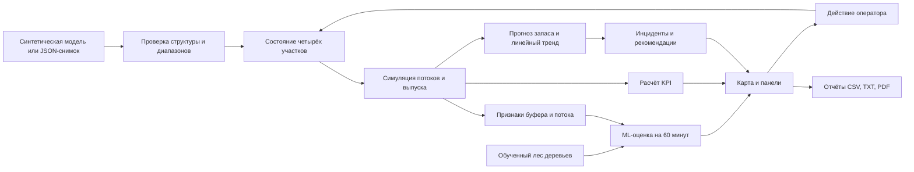

# Архитектура и данные

## Поток информации

`engine.js` не зависит от браузера и проверяется Node.js. `app.js` управляет экраном и вызывает функции модели. Данные хранятся в памяти; последний снимок сохраняется локально. Сервисный сервер только отдаёт статические файлы. Права доступа и промышленный backend не входят в этот прототип.

## Обученная модель, версия 0.4

Признаки `ml-features.js` одинаковы при создании датасета и в браузере. Обучение scikit-learn выполняется в `ml/train.py`; лес и изотонический калибратор экспортируются в JSON и JS. `ml-runtime.js` выполняет прогноз без Python-сервера и поддерживает запуск из локального файла.

Цель — исчерпание буфера сборки в следующие 60 минут без ручного пополнения. Отбор целыми синтетическими сменами исключает попадание соседних точек в разные выборки. На внешних снимках, при уже исчерпанном буфере, короткой истории или выходе за диапазоны ML-оценка не выдаётся. Расчёт баланса остаётся доступен. Качество на предприятии неизвестно; подробности — `ml/README.md`.

## Подготовка внешней истории, версия 0.5

`ml/prepare-telemetry.js` принимает CSV сборки, рассчитывает признаки через общий `ml-features.js`, исключает неполные окна, разрывы, вмешательства и остановки по другим причинам. Целые смены распределяются по заданным границам времени; пересекающие границы смены исключаются.

`ml/train.py` поддерживает эти заранее назначенные выборки и сохраняет отдельные артефакты внутри `ml/local/`. Происхождение данных и причины остановок нужно подтвердить; новые модели автоматически не подключаются к интерфейсу. Формат — `ml/telemetry-format.md`. Реальная история пока отсутствует; этот маршрут не запускался.

## Снимок JSON, версия 1

Корень: `schemaVersion: 1`, `elapsedMinutes` (1–720), `shift` (`day` или `night`), `lines` — четыре записи с уникальными `id`: `body`, `paint`, `assembly`, `logistics`.

| Поле линии | Единицы и смысл |
|---|---|
| capacity | мощность в единицах/ч, >0 |
| throughput | текущий темп в единицах/ч, не выше capacity |
| produced | накопленные обработанные единицы |
| defects | ожидаемые дефектные единицы, не выше produced |
| downtimeMinutes | накопленный простой, не выше elapsedMinutes |
| status | running / warning / stopped |
| buffer | запас комплектов для сборки, 0–150 |
| demandPerHour | расход комплектов/ч для сборки |
| replenishmentPerHour | подача комплектов/ч для сборки |

Снимок не содержит внешних HTML, названий оборудования или кода. Названия задаются приложением. Размер импортируемого файла ограничен 1 МБ. Ошибка в любом поле отменяет замену текущего состояния.

## Формулы

- Выпуск всего завода = выпуск финальной сборки; выпуск разных стадий не суммируется.
- План на момент снимка = мощность × прошедшие минуты / 60.
- Загрузка = сумма текущих темпов / сумма мощностей выбранных линий × 100%.
- Доступность = (1 − сумма простоев / суммарное время наблюдения линий) × 100%.
- Качество = (1 − дефекты / обработанные единицы) × 100%.
- Запас после шага = max(0, запас + (подача − расход) × длительность шага / 60).
- До исчерпания = запас / (расход − подача) × 60 при расходе выше подачи.

Модель учитывает часть шага до остановки: если запас закончился в середине интервала, выпуск считается только за активные минуты. История буфера дополнительно аппроксимируется линейной регрессией по последним восьми точкам, минимум трём. При отрицательном наклоне вычисляется пересечение с нулём. Пополнение сбрасывает старый тренд.

Индекс риска сборки: 100 при остановке; 90 при горизонте ≤30 мин; 75 при ≤60; 55 при ≤120; 25 при более длительном дефиците; 8 при достаточной подаче. Это условные пороги, требующие калибровки на предприятии. R² показывает соответствие линейного тренда наблюдениям и не доказывает точность будущего прогноза.

## Возможное развитие

Следующая версия: API приёма телеметрии, база временных рядов, карта реальных участков, связь с MES/ERP, роли оператора и руководителя. Для прогнозов оборудования потребуются размеченная история остановок и оценка по времени с отдельным будущим периодом. Текущая обученная модель демонстрирует работу ML на симуляции; её качество на предприятии пока неизвестно.
