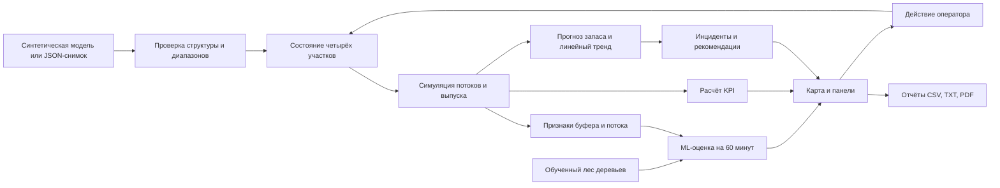

# Архитектура и данные

## Поток информации

`engine.js` не зависит от браузера и проверяется Node.js. `src/App.jsx` управляет React-состоянием; компоненты вызывают функции модели через неизменяемое обновление копии состояния. Vite собирает приложение в `site/`. Данные хранятся в памяти; последний снимок сохраняется локально. Сервисный сервер только отдаёт статические файлы. Права доступа и промышленный backend не входят в этот прототип.

## Обученная модель, версия 0.4

Признаки `ml-features.js` одинаковы при создании датасета и в браузере. Обучение scikit-learn выполняется в `ml/train.py`; лес и изотонический калибратор экспортируются в JSON и JS. `ml-runtime.js` выполняет прогноз без Python-сервера и не требует Python-сервера. Приложение запускается через локальный HTTP.

Цель — исчерпание буфера сборки в следующие 60 минут без ручного пополнения. Отбор целыми синтетическими сменами исключает попадание соседних точек в разные выборки. На внешних снимках, при уже исчерпанном буфере, короткой истории или выходе за диапазоны ML-оценка не выдаётся. Расчёт баланса остаётся доступен. Качество на предприятии неизвестно; подробности — `ml/README.md`.

## Подготовка внешней истории, версия 0.5

`ml/prepare-telemetry.js` принимает CSV сборки, рассчитывает признаки через общий `ml-features.js`, исключает неполные окна, разрывы, вмешательства и остановки по другим причинам. Целые смены распределяются по заданным границам времени; пересекающие границы смены исключаются.

`ml/train.py` поддерживает эти заранее назначенные выборки и сохраняет отдельные артефакты внутри `ml/local/`. Происхождение данных и причины остановок нужно подтвердить; новые модели автоматически не подключаются к интерфейсу. Формат — `ml/telemetry-format.md`. Реальная история пока отсутствует; этот маршрут не запускался.

## Снимок JSON, версия 1

Корень: `schemaVersion: 1`, `elapsedMinutes` (1–720), `shift` (`day` или `night`), `lines` — четыре записи с уникальными `id`: `body`, `paint`, `assembly`, `logistics`.

| Поле линии | Единицы и смысл |
|---|---|
| capacity | мощность в единицах/ч, >0 |
| throughput | текущий темп в единицах/ч, не выше capacity |
| produced | накопленные обработанные единицы |
| defects | ожидаемые дефектные единицы, не выше produced |
| downtimeMinutes | накопленный простой, не выше elapsedMinutes |
| status | running / warning / stopped |
| buffer | запас комплектов для сборки, 0–150 |
| demandPerHour | расход комплектов/ч для сборки |
| replenishmentPerHour | подача комплектов/ч для сборки |

Снимок не содержит внешних HTML, названий оборудования или кода. Названия задаются приложением. Размер импортируемого файла ограничен 1 МБ. Ошибка в любом поле отменяет замену текущего состояния.

## Формулы

- Выпуск всего завода = выпуск финальной сборки; выпуск разных стадий не суммируется.
- План на момент снимка = мощность × прошедшие минуты / 60.
- Загрузка = сумма текущих темпов / сумма мощностей выбранных линий × 100%.
- Доступность = (1 − сумма простоев / суммарное время наблюдения линий) × 100%.
- Качество = (1 − дефекты / обработанные единицы) × 100%.
- Запас после шага = max(0, запас + (подача − расход) × длительность шага / 60).
- До исчерпания = запас / (расход − подача) × 60 при расходе выше подачи.

Модель учитывает часть шага до остановки: если запас закончился в середине интервала, выпуск считается только за активные минуты. История буфера дополнительно аппроксимируется линейной регрессией по последним восьми точкам, минимум трём. При отрицательном наклоне вычисляется пересечение с нулём. Пополнение сбрасывает старый тренд.

Индекс риска сборки: 100 при остановке; 90 при горизонте ≤30 мин; 75 при ≤60; 55 при ≤120; 25 при более длительном дефиците; 8 при достаточной подаче. Это условные пороги, требующие калибровки на предприятии. R² показывает соответствие линейного тренда наблюдениям и не доказывает точность будущего прогноза.

## Возможное развитие

Следующая версия: API приёма телеметрии, база временных рядов, карта реальных участков, связь с MES/ERP, роли оператора и руководителя. Для прогнозов оборудования потребуются размеченная история остановок и оценка по времени с отдельным будущим периодом. Текущая обученная модель демонстрирует работу ML на симуляции; её качество на предприятии пока неизвестно.

## Диагностика Scania APS, версия 0.6

`ml/download-aps.py` получает оригинальные файлы из закреплённого публичного зеркала и проверяет хеши. `ml/train-aps.py` обучает отдельный лес с медианным заполнением пропусков и калибровкой. Диагностика доступна на `docs/aps-demo.html` через `aps-runtime.js`; параметры записей Scania не преобразуются в телеметрию заводских линий. Главная страница загружает только краткий отчёт `data/aps-summary.js`; полный лес загружается на странице диагностики. Источники, GPL и ограничения — в `ml/APS-README.md`.

## Эксперимент со временем пополнения

`scenario-analysis.js` создаёт две независимые синтетические смены задержки деталей. Начальные значения выпуска и простоя вычитаются из результата; горизонт составляет следующие 120 минут, шаг — 5 минут. В экспериментальной ветви выбранное время вызывает обычное `PlantEngine.replenish` с добавлением 30 комплектов и восстановлением подачи до 21 в час. В базовой ветви вмешательства нет. Пополнение на 120-й минуте лежит в конце горизонта и не даёт дополнительного выпуска.

Интерфейс в отчётах меняет только параметр эксперимента. Производственное состояние, источник данных и журнал текущей смены не передаются в модуль. JSON-экспорт содержит параметры, результаты и ряд выпуска; расчёт не является прогнозом ML или измеренным эффектом предприятия. Скрипт `scripts/compare-scenarios.js` использует тот же модуль.

## React и импортированные остановки, версия 0.8

Общие вычислительные модули экспортируют API для Node и браузерной сборки. Хранение локального снимка не сохраняет историю и журнал. Таймер приостанавливается в карточке участка и настройках. У импортированной остановленной линии оборудование остаётся остановленным после шага и пополнения; буферная остановка сборки восстанавливается после подачи. Формат снимка не содержит причины остановки: при нулевом буфере и недостаточной подаче остановка сборки интерпретируется как буферная. Публичный контекст Allur отделён от состояния модели и обучения.

## CSV и экономика, версия 0.9

CSV содержит заголовок `schemaVersion;elapsedMinutes;shift;id;capacity;throughput;produced;defects;downtimeMinutes;status;buffer;demandPerHour;replenishmentPerHour` и четыре строки. Время, версия и смена повторяются в каждой строке и должны совпадать. Papa Parse распознаёт разделитель и кавычки; приложение проверяет поля и вызывает `validateImport`. [Пример](../data/sample-production.csv). CSV-отчёт с русскими колонками не соответствует схеме снимка.

Экономическая оценка отделена от производственного движка и веса ML. Она получает результат сравнения и пользовательские ставки, возвращает предотвращённые затраты, стоимость действия, баланс, порог окупаемости и допущения. React хранит ставки при переходах между разделами; они не заменяют фактические нормативы предприятия. В JSON сравнения добавлено `economicEvaluation`: объект при заполненных допустимых ставках либо `null`.
