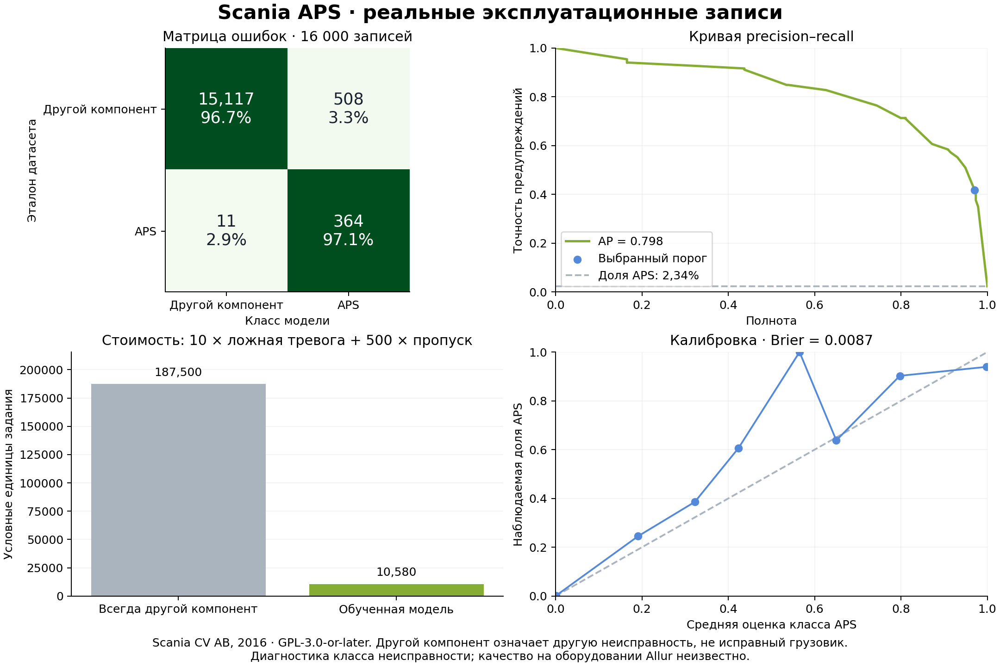

# Диагностика на открытых данных Scania

В версии 0.6 скачан **APS Failure at Scania Trucks** и обучена отдельная модель диагностики. Это реальные эксплуатационные записи грузовиков, опубликованные Scania CV AB в 2016 году. Цель — различить неисправность конкретного компонента пневмосистемы APS и неисправность другого компонента.

[Карточка UCI](https://archive.ics.uci.edu/dataset/421/aps+failure+at+scania+trucks) · [Закреплённое зеркало](https://github.com/DeepDive-UG/Scania-failure-model/tree/cf7d236b2c3a2196931f0acba0ab858ee9071fa2/data/raw)

Данные заводского буфера в подходящем формате не найдены. Scania не содержит запаса деталей, расхода, подачи и временного горизонта отказа. Прогноз буфера остаётся обученным на синтетических сменах; Scania используется для дополнительной диагностической задачи.

## Происхождение и лицензия

Оригинальные CSV, описание, manifest и копия GPL сохранены в `public/aps/`. Заголовки исходных файлов содержат Copyright (c) 2016 Scania CV AB и **GPL-3.0-or-later**. Доноры: Tony Lindgren и Jonas Biteus. Файлы скачаны из GitHub-зеркала; карточка UCI напрямую в этом окружении не загружалась.

Скачивание закреплено на commit `cf7d236b2c3a2196931f0acba0ab858ee9071fa2`. Проверяются размер и Git blob SHA-1 каждого файла, также сохраняется SHA-256. Эти хеши подтверждают соответствие конкретному зеркалу; сравнение с текущей загрузкой UCI не выполнялось. Код чужого проекта не переносился.

## Данные и обучение

| Выборка | Записи | Класс APS |
| --- | ---: | ---: |
| Обучение леса | 48 000 | 800 |
| Калибровка и порог | 12 000 | 200 |
| Исходная отложенная оценка | 16 000 | 375 |

Обучающая часть содержит 60 000 записей; применяется стратифицированное разбиение 80/20. До разбиения проверяются повторы признаков: совпадений с выборкой оценки и повторов внутри обучения в полученных файлах нет. Исходная выборка оценки сохранена полностью.

В наборе 170 обезличенных счётчиков и интервалов гистограмм. Используются 167: константные признаки и признаки с минимум 80% пропусков исключены. Выбор признаков и медианы для пропусков рассчитаны только на обучающих 48 000 записях.

RandomForestClassifier: 64 дерева, глубина до 12, минимум 8 записей в листе, balanced_subsample, seed 20261002. Изотоническая калибровка и порог используют выборку настройки. Порог 3,268% выбран по минимуму `10 × FP + 500 × FN`, как в задании Scania. Условные единицы не описывают стоимость ошибок Allur.

## Результаты

| Показатель | Значение |
| --- | ---: |
| Полнота, recall | 97,1% |
| Точность предупреждений, precision | 41,7% |
| F1 | 0,584 |
| ROC-AUC | 0,9904 |
| Average precision | 0,7981 |
| Brier score | 0,00869 |
| Верно распознаны записи APS | 364 |
| Пропущены записи APS | 11 |
| Ложные предупреждения APS | 508 |
| Стоимость по метрике задания | 10 580 |

Постоянный ответ «другой компонент» имеет стоимость 187 500. Выбранный порог обнаруживает почти все записи APS, но большинство предупреждений ложные: 508 из 872. Поэтому precision показывается рядом с полнотой.

Метка `neg` означает **неисправность другого компонента**, а не исправный грузовик. Метрики считаются по записям; число уникальных грузовиков установить нельзя. В данных нет времени и идентификаторов машин: разделение по грузовикам и будущим периодам подтвердить невозможно. Калибровка и порог используют одну выборку настройки; итоговая оценка выполнена отдельно.



## Воспроизведение и демонстрация

В «Отчётах и аналитике» откройте «Диагностика Scania APS», либо откройте `../docs/aps-demo.html`. Расчёт выполняется в браузере без Python. Можно выбрать исходную запись, скачать её JSON или загрузить запись с теми же признаками.

Для повторного обучения после установки зависимостей:

```sh
python3 ml/download-aps.py
python3 ml/train-aps.py
python3 ml/plot-aps.py
```

Доступны также `npm run ml:aps:data`, `npm run ml:aps:train`, `npm run ml:aps:report`. Скачивание требует доступа к `raw.githubusercontent.com`; данные уже включены в архив. Исходные CSV занимают около 56,6 МБ.

JSON должен содержать объект `features` с ровно 170 исходными именами, числами или `null`. Пустой или почти пустой вход отклоняется. Вход за диапазонами обучения отмечается предупреждением. Значения внутри диапазонов также не доказывают применимость модели.

Метрики относятся ко всем исходным 16 000 записям с медианным заполнением пропусков. Браузер дополнительно отклоняет записи, в которых слишком мало измерений; этот фильтр не применялся к итоговым метрикам. Число таких записей приведено в `report.json`.

Восемь примеров — первые четыре записи каждого класса. Это сбалансированная демонстрация, не распространённость APS в наборе. Метки примеров показаны отдельно и не участвуют в прогнозе. Скачанный пример сохраняет атрибуцию данных.

Диагностика не меняет состояния линий или инциденты завода. Модель не определяет время будущей поломки и не применяется к оборудованию Allur без подходящей телеметрии и отдельной оценки. В версии 0.6.1 выполнены браузерная проверка диагностики и сравнение JavaScript с предсказаниями Python на всех 16 000 записях оценки; решения совпадают. Полный отчёт — [docs/verification.md](../docs/verification.md).

## Артефакты

- `public/aps/` — оригиналы, лицензия и происхождение.
- `train-aps.py` — обучение и экспорт.
- `results/aps/report.json` — параметры, ID записей, метрики и ограничения.
- `results/aps/holdout-predictions.csv` — результаты по всем 16 000 записям.
- `results/aps/evaluation.png` и `.pdf` — графики.
- `../models/aps-diagnostic.json` и `.js` — переносимая модель.
- `../data/aps-examples.json` и `.js` — исходные примеры для демонстрации.
