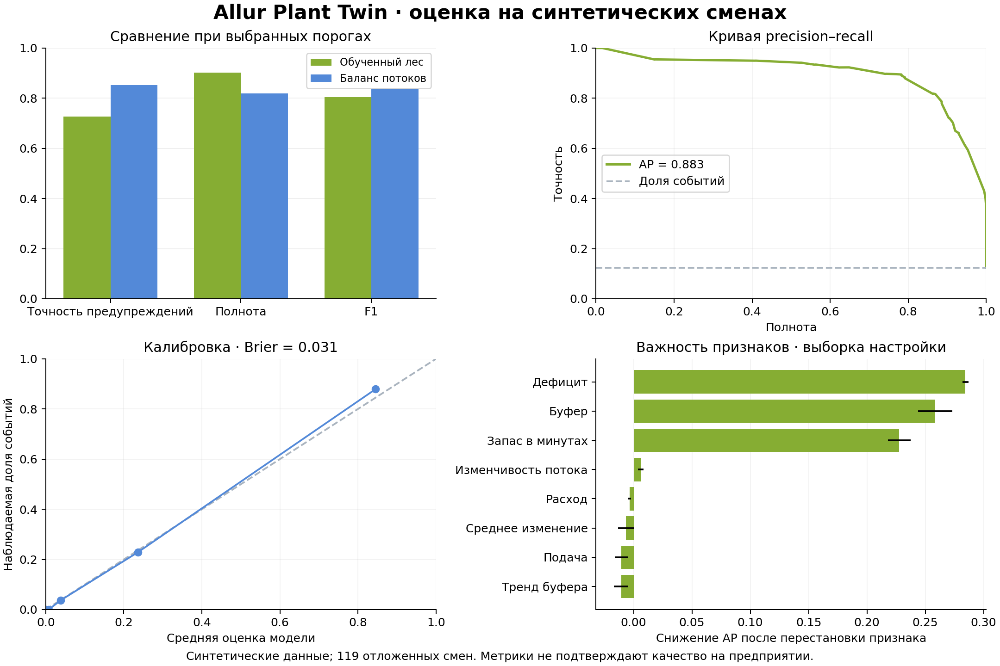

# Обученная модель исчерпания буфера

Модель `allur-buffer-rf-v1` оценивает, исчерпается ли буфер сборки в следующие **60 минут без ручного пополнения**. Это RandomForestClassifier из scikit-learn, 64 дерева, максимальная глубина 8; оценки откалиброваны методом изотонической регрессии.

Данные полностью синтетические. В папке задания Allur обнаружены только два PDF с описанием кейса; временных рядов предприятия нет. Источник задания: [кейс №2](https://drive.google.com/file/d/1VQM_DD7e4ecX8FRukZEB35kOjtetoHQB/view).

## Воспроизведение

Требуются Node.js 18+ и Python 3.11+:

```sh
python3 -m venv .venv
.venv/bin/python -m pip install -r ml/requirements.txt
node ml/generate-data.js
.venv/bin/python ml/train.py
.venv/bin/python ml/plot-results.py
```

Если зависимости установлены в активном Python, доступны `npm run ml:train` и `npm run ml:report`. Для обычного запуска приложения Python-зависимости не нужны: обученный артефакт уже включён.

## Датасет

Генератор создаёт 600 независимых восьмичасовых смен. Материальный баланс рассчитывает существующий `engine.js`. Сценарии подачи: стабильная, длительный дефицит, восстановление и переменная подача. Поток изменяется каждые 5 минут; наблюдения для признаков берутся с интервалами 5, 10 или 15 минут. Расход постоянен внутри смены, ручных пополнений нет.

После удаления уже остановленных состояний, короткой истории и неполного будущего горизонта остаются 22 041 наблюдение из 595 смен. Пять смен не дали пригодных для обучения наблюдений.

| Выборка | Смены | Наблюдения | События исчерпания |
| --- | ---: | ---: | ---: |
| Обучение | 357 | 13 070 | 1 570 |
| Калибровка и порог | 119 | 4 528 | 526 |
| Отложенная оценка | 119 | 4 443 | 552 |

Целые смены относятся только к одной выборке. Метка использует следующие 60 минут; признаки используют только текущую точку и прошлую историю. Сценарий генератора, ID смены и будущие значения не входят в признаки. Seed фиксирован: 20261002; SHA-256 датасета записан в manifest и модель.

Восемь признаков: буфер, расход, подача, текущий дефицит, запас в минутах расхода, наклон истории буфера, изменчивость и среднее изменение потока. Их общий вычислитель `ml-features.js` используется и при генерации, и в браузере.

## Результаты

Порог предупреждения 28% выбран на выборке настройки: максимальная точность при полноте не ниже 85%. Отложенные смены не использовались для обучения, калибровки или выбора порога.

| Показатель | Обученная модель | Баланс текущих потоков |
| --- | ---: | ---: |
| Точность предупреждений, precision | 72,6% | 85,1% |
| Доля обнаруженных событий, recall | 90,2% | 81,9% |
| F1 | 0,805 | 0,835 |
| Верные предупреждения | 498 | 452 |
| Ложные предупреждения | 188 | 79 |
| Пропущенные события | 54 | 100 |

ROC-AUC модели: 0,983; average precision: 0,883; Brier score: 0,031. Интервалы неопределённости в `results/report.json` получены повторной выборкой целых смен. Наблюдения внутри смены зависимы.

Модель находит больше будущих событий, но выдаёт больше ложных предупреждений. При выбранном пороге F1 выше у расчёта по текущему балансу. AUC/AP простого расчёта вычислены по двоичному предупреждению; они не описывают качество непрерывной вероятностной оценки.



## Работа в приложении

`models/buffer-risk.js` содержит дерево решений и калибратор. `ml-runtime.js` выполняет прогноз локально, с теми же float32-входами, что используются в scikit-learn. Модель показывается рядом с индексом риска по правилам. Индекс 75/100 и ML-оценка имеют разный смысл.

Прогноз не выдаётся, если буфер уже исчерпан, данных меньше трёх точек или десяти минут, признаки вне указанных диапазонов либо загружен внешний снимок. После пополнения нужен новый ряд наблюдений.

Проценты относятся к синтетическому генератору с меняющейся подачей. На реальных данных Allur модель ещё не оценивалась. Она прогнозирует исчерпание комплектующих; поломки оборудования не входят в цель. Поддержка диапазонов сама по себе не доказывает соответствие входа обучающему распределению.

## GitHub и лицензии

- Используемая библиотека: [scikit-learn/scikit-learn](https://github.com/scikit-learn/scikit-learn), версия 1.8.0, BSD-3-Clause. Лицензия сохранена в `licenses/scikit-learn-BSD-3-Clause.txt`.
- Официальный пример для изучения калибровки: [Comparison of Calibration of Classifiers](https://github.com/scikit-learn/scikit-learn/blob/1.8.0/examples/calibration/plot_compare_calibration.py).
- Изучен [Predictive-Maintenance-using-LSTM](https://github.com/umbertogriffo/Predictive-Maintenance-using-LSTM): он рассматривает авиационные двигатели и требует другой телеметрии. Его код, данные и веса в текущую модель не перенесены.

Генератор смен, признаки, сценарий обучения и браузерный исполнитель написаны для этого проекта. Пакеты Python указаны в `requirements.txt`; их исходники в архив приложения не включены.

## Данные для следующего обучения

В версии 0.5 добавлены `prepare-telemetry.js` и отдельный маршрут обучения на внешней истории. Формат CSV, правила исключения окон, разделение смен по времени и команды — в [telemetry-format.md](telemetry-format.md). Шаблон заголовка — `templates/telemetry.csv`. Реальная история ещё не предоставлена; новый маршрут не запускался. Ранее обученная демо-модель и её метрики относятся к синтетическому датасету.

Нужны временные ряды по сменам: `episode_id`, время наблюдения, буфер, расход, подача, фактические остановки и вмешательства оператора. Нужны также причины остановок: событие исчерпания деталей следует отличать от ремонта или поломки.

Для заводской истории подготовлен отбор целых смен по времени: смены, пересекающие границу выборки, и неполные 60-минутные горизонты исключаются. Случайный отбор независимых синтетических смен для неё не подходит. Окна с пополнением исключаются; это может создавать смещение и требует анализа. Затем нужны переобучение, отдельная калибровка, оценка на будущем периоде и согласование стоимости пропусков и ложных предупреждений.

## Артефакты

- `data/telemetry.csv` — сгенерированная история потоков.
- `data/training.csv` и `data/manifest.json` — признаки, метки и происхождение данных.
- `../models/buffer-risk.json` и `../models/buffer-risk.js` — обученный артефакт.
- `results/report.json` — метрики, списки смен, параметры, ограничения.
- `results/holdout-predictions.csv` — оценки на отложенных сменах.
- `results/evaluation.png` и `results/evaluation.pdf` — графики для обсуждения и презентации.
